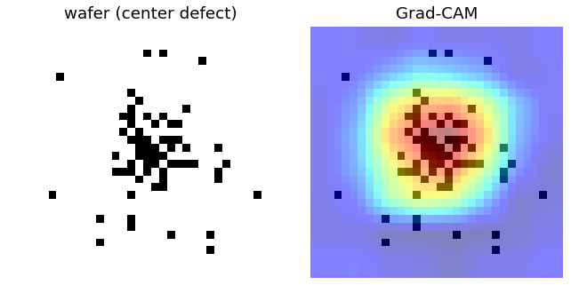
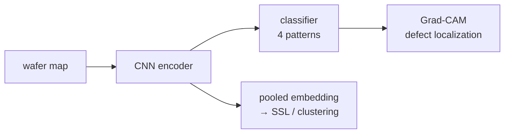

# Wafer Defect Atlas

**Spatial defect-pattern classification + localization for semiconductor wafer
maps.** A compact CNN classifies the canonical failure signatures (center /
edge-ring / scratch / none) and **Grad-CAM** shows *where* on the wafer the defect
is — so the model is explainable, not a black box. The pooled encoder features are
the seam for self-supervised pretraining (SimCLR) and unknown-pattern clustering.

Trains on CPU in ~10 s on a synthetic wafer set with the same spatial signature as
WM-811K; the production path loads **WM-811K** (811k maps) + **MixedWM38** and swaps
in a ViT / self-supervised encoder.





## Results (`demo_smoke.py`, CPU, 15 epochs)
| metric | value |
|---|---|
| 4-class test accuracy | **0.997** |
| Grad-CAM center-of-mass error (center defect) | **1.9 px** (32×32 grid) |

Grad-CAM lands within ~2 px of the true wafer center — it localizes the defect,
not just names it.

## Quickstart
```bash
pip install -r requirements.txt   # torch, numpy (matplotlib optional for the figure)
python demo_smoke.py              # trains, evaluates, writes gradcam.png
PYTHONPATH=. python tests/test_smoke.py
```

## What it demonstrates
- **Spatial defect classification** on the WM-811K pattern taxonomy.
- **Explainability** — Grad-CAM localization, verified against the known defect region.
- **A path to self-supervision** — `WaferCNN.embed()` exposes pooled features for
  SimCLR pretraining (label-efficient; WM-811K is only ~20% labeled) and
  UMAP+HDBSCAN clustering to surface *unknown* defect patterns.

## Scaling to real data
- Load **WM-811K** + **MixedWM38** (Kaggle) in place of the synthetic generator;
  the tensor shape `(n, 1, H, W)` is unchanged.
- Swap `WaferCNN` for a ViT-small; add a **SimCLR** head for self-supervised
  pretraining on the unlabeled majority, then a linear probe for the 38 mixed types.
- Cluster embeddings (UMAP + HDBSCAN) to build the "atlas" of novel patterns.

## Design
`wafermap/` — `data.py` (synthetic wafer maps + `CLASSES`) · `model.py`
(`WaferCNN`, `grad_cam`) · `train.py`.

MIT licensed. Synthetic maps stand in for WM-811K — see scaling notes.
