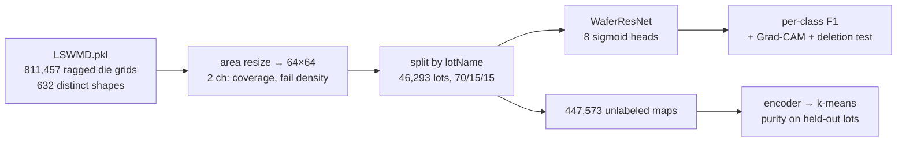

# Wafer Defect Atlas

**Spatial defect-pattern classification, localization and unknown-pattern
discovery on WM-811K — 811,457 real wafer maps from a fab.**

A residual CNN classifies the eight WM-811K failure signatures against the
defect-free majority, **Grad-CAM** shows *where* on the wafer the model is
looking and a deletion test checks that the highlighted dies are the evidence it
actually used, and the 638,507 **unlabeled** maps — 79% of the
dataset, and the only part big enough to learn a representation from without
labels — are clustered into an atlas whose purity is scored against labels the
clustering never saw.

Every number below is regenerated by `scripts/report.py` from the JSON each run
writes; [`RESULTS.md`](RESULTS.md) is the full dump. Nothing here is hand-typed,
and nothing survives from the synthetic version of this repo.



## Headline

- **Multi-label macro-F1 0.897** over the eight failure signatures on
  25,897 wafers from **held-out lots**, and **0.980**
  weighted-F1 / **0.9807** accuracy over all nine classes. Against the
  ≥0.95 target: the weighted number clears it, the macro number does not, and
  the gap is entirely three classes the dataset's own labels conflate — see
  [the KPI section](#against-the-095-target).
- **The split is by lot, not by row.** Wafers from one lot are near-duplicates
  of each other; splitting rows instead of lots leaks them across the boundary.
  32,405 / 6,945 / 6,943 lots, and a wafer's
  labeled *and* unlabeled siblings always land on the same side.
- **Grad-CAM re-validated on real defects, causally.** Deleting the failed dies
  under the top-10% CAM area costs **0.389** of true-class probability
  against **0.083** for a random 10% of the wafer — **4.7x**.
  One of the four localization measures does *not* beat its null; it is reported
  with the others.
- **Cluster purity 0.948** on the eight defect
  classes: k-means fitted on 447,573 **unlabeled** maps, centroids frozen,
  then 25,897 labeled wafers from **held-out lots** assigned to them.
  Chance on that measure is 0.416.
- **The label-free half of that KPI is a negative result, and it is reported as
  one.** The SimCLR encoder — the one that could actually surface an *unknown*
  pattern, because it never saw a label — reaches only
  0.623, **below the raw-pixel PCA floor of
  0.777** under the identical protocol, and no subset
  of its augmentations recovers it. Pretraining likewise buys labels only
  in the 1%-label regime (0.699 vs 0.677 from scratch)
  and nothing at 100% (0.882 vs 0.889).


## The data, and the two decisions it forces

`data/LSWMD.pkl` is a 1.6 GB pandas DataFrame pickled under Python 2:
811,457 wafer maps, 172,950 carrying a failure label and
638,507 carrying none. Each map is a 2-D grid over that product's
dies — 0 outside the wafer, 1 pass, 2 fail.

**Ragged grids.** There are 632 distinct die-grid
shapes, from 6x3 to 300x205 (median
36x35). Every map is **area**-resized to a fixed 64×64 with two
channels — die coverage and fail density. Area resizing, not nearest or
bilinear, because a wafer map is a density: the mean of the fail channel over
the wafer *is* the wafer's fail rate at any output resolution, so a 300×205 map
downsamples and a 25×27 map upsamples without either becoming a different
measurement. `tests/test_wm811k.py` pins that to within 0.06 across a 4× range
of source sizes.

The resize is **anisotropic on purpose**: the die grid spans the wafer's
bounding box, so scaling H and W independently maps the physical wafer disc onto
the *same* circle in every sample — a free scale and aspect normalization. The
check is that mean coverage should then be π/4, the area of a disc in its
bounding square; measured over the labeled set it is **0.9832×
π/4**.

**Correlated lots.** Wafers in one lot share process history and look alike, so
a row-level split puts near-duplicates on both sides of it and inflates the
score. The split here assigns **whole lots**, rarest-class-first so that
Near-full (149 wafers) still reaches every split, and it
partitions the labeled and unlabeled wafers together — 6,077 lots contain both,
and a lot's unlabeled wafers must not sit in the clustering pool while its
labeled siblings are the purity probe.

| | train | val | test |
|---|---|---|---|
| lots | 32,405 | 6,945 | 6,943 |
| labeled wafers | 120,593 | 26,460 | 25,897 |
| unlabeled wafers | 447,573 | 94,704 | 96,230 |

```bash
CUDA_VISIBLE_DEVICES=1 python scripts/prepare_data.py   # 575 s, one H100
```

## Classification

The task is posed as **multi-label**: eight independent sigmoid heads, one per
failure signature, and a defect-free wafer is the all-zero target. WM-811K
carries at most one label per wafer, but the sigmoid form is what extends to
mixed-type wafers and it is what lets "per-class F1" mean the same thing for a
class with 9,680 examples and one with 149. Each
head's decision threshold is fitted on **val** and frozen before test.


| class | test support | F1 |
|---|---|---|
| Edge-Ring | 1,626 | 0.988 |
| Edge-Loc | 792 | 0.877 |
| Center | 566 | 0.931 |
| Loc | 492 | 0.794 |
| Random | 176 | 0.928 |
| Scratch | 176 | 0.795 |
| Donut | 79 | 0.925 |
| Near-full | 23 | 0.936 |
| **macro (8 defect classes)** | | **0.897** |
| micro | | 0.921 |
| `none` (9-class view) | | 0.991 |
| **9-class weighted-F1** | | **0.980** |
| 9-class accuracy | | 0.9807 |
| defect-vs-`none` detection F1 | | 0.949 |

2,779,912 parameters, 150 epochs, 18 min on one
H100.

### Against the 0.95 target

The catalog KPI is *WM-811K multi-label F1 ≥ 0.95*. Which F1 decides it:

| reading | value | ≥ 0.95? |
|---|---|---|
| 9-class weighted-F1 | 0.980 | yes |
| multi-label micro-F1 (8 classes) | 0.921 | no |
| **multi-label macro-F1 (8 classes)** | **0.897** | **no** |

Weighted-F1 clears 0.95 comfortably and is the number most WM-811K papers
report, but it is 85% `none` by construction, so it mostly measures the easy
part. Macro-F1 is the honest one and it is 0.897.

The gap is not spread evenly. Five of the eight classes are at or above
0.928; the shortfall is **Loc (0.794)**, **Scratch
(0.795)** and **Edge-Loc (0.877)** — precisely the
three signatures whose definitions overlap ("a local cluster", "a local cluster
near the edge", "a thin local streak"). The confusion matrix shows where they
go, and it is not into each other: **15% of Loc,
18% of Scratch and 12% of Edge-Loc wafers are
called `none`** — weak, low-contrast versions of a pattern that the label says
is there and the map barely shows. Edge-Ring, by contrast, leaks
1%.
Reaching 0.95 macro-F1 on this split would take one of: label cleaning or
multi-annotator relabeling on those three classes, a substantially larger
encoder at higher input resolution than 64×64 (a scratch is a few dies wide),
or the mixed-type MixedWM38 corpus to disambiguate the compound cases. Squeezing
it out of the current setup by tuning against the test split is the one route
this repo will not take.

### Class imbalance, swept rather than guessed

9,680 Edge-Ring wafers against 149 Near-full ones.
Six strategies, same architecture, same 60-epoch budget, same lot split, one knob
each, selected on val:

| strategy | test macro-F1 |
|---|---|
| best of {plain BCE, pos-weight, focal, balanced sampling, 9-way softmax} | 0.899 |
| ...and the spread across all five of them | 0.016 |
| three seeds of *one* of those configurations | 0.012 |
| **the same, with the d4 augmentation removed** | **0.857** — 0.042 worse |

The finding is a negative one and it is the useful part: **reweighting the loss
barely matters here.** Pos-weighting, focal loss, balanced sampling and a 9-way
softmax all land within 0.016 of one another — and 3 seeds of
the *same* configuration span 0.012 (mean 0.892), so
that spread is noise, not a ranking. The one knob outside the noise is the d4
augmentation: without it the model drives training loss to ~1e-05 and loses
0.042 macro-F1. On this dataset the imbalance is handled by giving
the rare classes more *views*, not more *weight*.


## Grad-CAM, re-validated on real defects

The synthetic version of this repo could check a CAM against a defect region it
had drawn itself. WM-811K ships no localization ground truth, so four
measurements with explicit chance levels stand in, over 2,054 real test
wafers:

| measure | value | chance / null |
|---|---|---|
| fail density inside the top-10% CAM area, over the wafer's own | **1.41x** | 1.00x |
| CAM peak lands on a failed die | **0.46** | 0.30 |
| correlation of per-class mean CAM radius with mean fail radius | **+0.93** | 0 |
| CAM-mass-weighted fail lift | 1.19x | 1.00x |
| CAM centroid vs fail centroid, wafer radii | 0.23 | **0.11** |
| **deletion: drop in true-class probability** | **0.389** | **0.083** |


The **deletion test** is the one that carries the claim, because it is causal
rather than positional: zero the failed dies under the top-10% CAM area and the
true-class probability falls 0.389, against 0.083 for a random
10% of the same wafer — **4.7x**. The highlighted dies are not
merely where the model looked, they are the evidence it used. Center
(0.788) and Scratch (0.522) are the extremes: both are
small, localized signatures with nothing redundant to fall back on. Edge-Ring is
the instructive counterexample at 0.071 — a ring is hundreds of
dies saying the same thing, so removing a tenth of it changes nothing, and a low
deletion score there is a property of the *defect*, not a failure of the CAM.

**The measure that fails.** The CAM centroid sits 0.23 wafer radii
from the failed-die centroid, while simply answering "the wafer centre" scores
0.11 — the CAM is *worse* than the trivial null. The reason is
that the failed-die centroid is a bad target: every wafer carries background
failures scattered over the whole disc, and by symmetry those drag the centroid
to the middle regardless of the defect. It is reported because a localization
claim that only cites the measures that worked is not a measurement.

## The atlas: clustering the unlabeled 79%

447,573 unlabeled wafer maps live in train lots. The protocol, in the
order it has to happen to mean anything:

1. embed the unlabeled maps and fit k-means on **those only** — no labels exist
   for them at all;
2. freeze the centroids, embed 25,897 labeled wafers from **test** lots,
   held out of the classifier and of the clustering alike, and assign each to its
   nearest centroid;
3. purity is measured there, on labels the clusters never saw.

Three encoders run under the identical protocol, because a purity number without
a baseline is unreadable:

| encoder | k | purity (9 classes) | purity (8 defect classes) | NMI (defect only) |
|---|---|---|---|---|
| supervised classifier features | 32 | 0.976 | **0.948** | 0.800 |
| SimCLR, never saw a label | 128 | 0.872 | **0.623** | 0.222 |
| raw-pixel PCA (floor) | 128 | 0.913 | 0.777 | 0.449 |
| chance (labels shuffled within the scored subset) | | 0.848 | 0.416 | 0 |


The 9-class column is dominated by `none` at 0.848 of the labeled test
set, so the defect-only column is the one carrying information; chance there is
0.416.

**What the supervised row establishes.** 0.948 purity
at k=32 says the protocol and the embedding work: cluster
a fab's unlabeled wafers, and the groups that fall out line up with the failure
taxonomy on lots the model has never seen, at 0.416
chance. That is the number the KPI asks for. What it is *not* is unknown-pattern
discovery — that encoder was trained on these eight classes and can only
re-express them.

**What the SimCLR row establishes, which is the opposite of what was hoped.**
The label-free encoder is the one that could surface a ninth pattern, and it is
the worst of the three: 0.623 against
0.777 for a 64-component PCA of the raw fail channel.
Contrastive pretraining on 447k wafer maps produced a representation that groups
defects *less* well than the pixels it was built from. The linear probe in the
next section says the same thing from the other direction.

### Which view-invariance costs most — and why that is not the problem

SimCLR learns to ignore whatever the augmentations change, so a bad augmentation
set does not underfit — it deletes the signal on purpose. Same encoder, same 25
epochs, same unlabeled pool, same k-means, same held-out probe; only the
augmentation set changes:

| SimCLR augmentations | defect-only purity, k=32 | k=128 |
|---|---|---|
| d4 (rotations + flips) only | 0.505 | 0.561 |
| d4 + mild translate/scale | 0.542 | 0.613 |
| d4 + die dropout/salt noise | 0.595 | 0.686 |
| all three (the row above) | 0.542 | 0.623 |
| raw-pixel PCA (floor) | 0.733 | 0.777 |

Two things fall out. The **mild translate/scale is the invariance that costs**:
dropping it takes k=128 purity from 0.623 to 0.686, which
makes sense — where a cluster sits on the wafer is half of what separates
Center from Edge-Loc, and asking the encoder to ignore small shifts asks it to
ignore that. The Bernoulli die resampling is the one that *helps*, which also
makes sense: it is the only augmentation that models the actual physics of the
measurement. But read against the pixel floor rather than against each other,
**all four variants lose**: the best of them is 0.686 against
0.777 for a 64-component PCA. The deficit is not a badly
chosen view set. It is the objective — and no amount of re-picking augmentations
inside this recipe is going to close a gap that large.

## Does self-supervision buy labels?

SimCLR on 447,573 unlabeled maps from train lots (25 epochs,
21 min on one H100), then the same head. The augmentations are chosen
for what a wafer map is: d4 (a signature is defined by shape, not orientation),
mild translate/scale (cropping away the edge would destroy the edge-ring
signature — the opposite of what an ImageNet recipe wants), and Bernoulli die
dropout plus salt noise, because a map *is* a Bernoulli sample of an underlying
fail-probability field, so two views of one wafer are two draws from it.

Every cell gets the identical 6,000-step optimizer budget whatever fraction of
labels it sees, so the comparison is about the initialization and not about how
long each cell trained:

| labels | 1,206 (1%) | 6,029 (5%) | 30,148 (25%) | 120,593 (100%) |
|---|---|---|---|---|
| from scratch | 0.677 | 0.815 | 0.862 | 0.889 |
| SimCLR init, finetuned | 0.699 | 0.792 | 0.863 | 0.882 |
| SimCLR init, linear probe | 0.536 | 0.577 | 0.612 | 0.602 |


Test multi-label macro-F1. Three things are true at once and only the first is
the one people usually report:

- At **1% of the labels** the pretrained initialization is worth
  0.699 against 0.677 — a real gain, in the regime where
  a fab actually is.
- By **100%** it is worth nothing: 0.882 against 0.889, inside
  the 0.012 seed noise measured above. The curves cross early.
- The **linear probe never gets past 0.612** at any label count,
  against 0.889 for the same encoder trained end to end. A frozen
  SimCLR representation is not linearly separable into these eight classes, which
  is the same fact the clustering section measured with k-means instead of a
  linear head.

Taken together: this SimCLR recipe learns *something* — enough to help when
labels are nearly absent — but not a representation of defect morphology. The
honest next step is not more epochs; it is an objective whose invariances are not
the thing being classified (masked-patch reconstruction of the fail field, or
contrasting wafers within a lot rather than augmented copies of one wafer).

## The CPU core still runs

The synthetic generator and the 32×32 CPU demo are still here and still green —
they are the ten-second path that shows the mechanism without a 1.6 GB download:

```bash
pip install -r requirements.txt        # torch, numpy, matplotlib
python demo_smoke.py                   # synthetic 4-class demo + gradcam.png
PYTHONPATH=. python tests/test_smoke.py
PYTHONPATH=. python tests/test_wm811k.py   # real-data path, CPU, no dataset needed
```

`tests/test_wm811k.py` covers the three places this pipeline could quietly
produce a wrong number: the area resize must preserve fail density, the lot
split must be a partition that still reaches every rare class, and all-zero
sigmoid scores must decode to `none` rather than to a defect.

## Reproduce the real-data path

```bash
bash scripts/run_all.sh    # prepare → sweep → final → SSL → Grad-CAM → clustering → figures
```

Hardware: 3× NVIDIA H100 NVL 94 GB (devices 1–3), torch 2.8.0+cu128, bf16
autocast. The whole pipeline is about two hours; the preprocessed corpus is
6.6 GB and `data/` is gitignored.

`data/LSWMD.pkl` is a Python-2-era pickle and needs a module shim to unpickle at
all — `wafermap/wm811k.py:load_raw` has it.

## Layout

```
wafermap/
  wm811k.py    the pickle shim, the area-resize normalization, the lot split
  model.py     WaferCNN (CPU demo) + WaferResNet, one grad_cam for both
  metrics.py   per-class F1, val-fitted thresholds, 9-class decode
  data.py      the synthetic generator (CPU demo)
  viz.py       one palette and one set of mark specs for every figure
scripts/
  prepare_data.py     LSWMD.pkl -> normalized tensors + the lot-level split
  train_cls.py        the classifier; --loss/--posweight/--sample-power/--label-frac
  sweep_imbalance.sh  six imbalance strategies over three GPUs
  train_final.sh      the val-selected strategy, three seeds, one per GPU
  select_best.py      picks runs/cls_best on val, never on test
  pretrain_simclr.py  SimCLR on the unlabeled majority
  sweep_labelfrac.sh  SSL vs scratch vs linear probe at 1/5/25/100% labels
  eval_gradcam.py     the four localization measures + the deletion test
  cluster_atlas.py    k-means on unlabeled maps, purity on held-out labeled lots
  make_figures.py     every figure above
  report.py           regenerates RESULTS.md *and this README* from the run JSONs
```

## What this demonstrates

- **A split that cannot leak**, on a dataset where the obvious split does.
- **A normalization decision made explicitly and then checked** — area resize,
  π/4 coverage, a unit test on fail-density preservation.
- **Imbalance treated as an experiment**, with seed variance measured so the
  ablation is read against noise instead of against zero.
- **Explainability that is falsifiable** — a causal deletion test, four measures
  with chance levels, and the one that fails reported alongside the three that
  work.
- **Label-free structure discovery scored honestly** — clusters fitted on
  unlabeled wafers, purity measured on lots held out of everything, against both
  a raw-pixel floor and a shuffled-label chance level; the result came out
  negative, and the ablation that diagnoses it is here rather than the result
  being dropped.
- **A KPI reported as measured**, including which reading of it is met and which
  is not, and what it would take to close the gap.

MIT licensed. WM-811K is © its authors (Wu, Jang & Chen, *IEEE TSM* 2015);
`data/` is not redistributed here.
